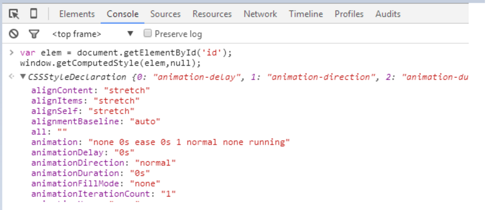
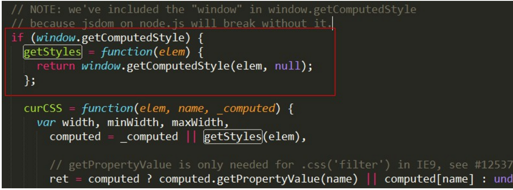

## CSS进阶之getComputedStyle

本文讲的是原生 JS 获取、设置元素最终样式的方法。
可能平时框架使用习惯了，以 jQuery 为例，使用 .css() 接口就能便捷的满足我们的要求。
再看看今天要讲的 `window.getComputedStyle` ，就像刚接触 JS 的时候，看到 document.getElementById  一样，
名字都这么长，顿生怯意。不过莫慌，我觉得如果我们不是只想做一个混饭吃的前端，那么越是底层的东西，
如果能够吃透它，越是能让人进步。

 
## getComputedStyle 与 getPropertyValue 

getComputedStyle 为何物呢，DOM 中 `getComputedStyle` 方法可用来获取元素中所有可用的css属性列表，
以数组形式返回，并且是只读的。IE678 中则用 `currentStyle` 代替 。

假设我们页面上存在一个 id 为 id 的元素，那么使用 getComputedStyle 获取元素样式就如下图所示：




    // 语法：
    // 在旧版本之前，第二个参数“伪类”是必需的，现代浏览器已经不是必需参数了
    // 如果不是伪类，设置为null，
    window.getComputedStyle("元素", "伪类");

尝试一下之后可以看到，window.getComputedStyle 获取的是所有的样式，如果我们只是要获取单一样式，该怎么做呢。
这个时候就要介绍另一个方法 — getPropertyValue 。

用法也很简单：

    // 语法：
    // 使用 getPropertyValue 来指定获取的属性
    window.getComputedStyle("元素", "伪类").getPropertyValue(style);

 
## IE 下的 currentStyle 与 getAttribute 

说完常规浏览器，再来谈谈老朋友 IE ，与 getComputedStyle 对应，在 IE 中有自己特有的 `currentStyle` 属性，
与 getPropertyValue 对应，IE 中使用 `getAttribute` 。

和 getComputedStyle 方法不同的是，currentStyle 要获得属性名的话必须采用驼峰式的写法。
也就是如果我需要获取 font-size 属性，那么传入的参数应该是 fontSize。
因此在IE 中要获得单个属性的值，就必须将属性名转为驼峰形式。

    // IE 下语法：
    // IE 下将 CSS 命名转换为驼峰表示法
    // font-size --> fontSize
    // 利用正则处理一下就可以了
    function camelize(attr) {
        // /-(w)/g 正则内的 (w) 是一个捕获，捕获的内容对应后面 function 的 letter
        // 意思是将 匹配到的 -x 结构的 x 转换为大写的 X (x 这里代表任意字母)
        return attr.replace(/-(w)/g, function(all, letter) {
            return letter.toUpperCase();
        });
    }
    // 使用 currentStyle.getAttribute 获取元素 element 的 style 属性样式
    element.currentStyle.getAttribute(camelize(style));


## style 与 getComputedStyle 

必须要提出的是，我们使用 element.style 也可以获取元素的CSS样式声明对象，
但是其与 getComputedStyle 方法还是有一些差异的。

1. 首先，element.style 是可读可写的，而 getComputedStyle  为只读。
2. 其次，element.style 只可以获取 style 样式上的属性值，而无法得到所有的 CSS 样式值，什么意思呢？
回顾一下 CSS 基础，CSS 样式表的表现有三种方式，
```
内嵌样式（inline Style） ：是写在 HTML 标签里面的，内嵌样式只对该标签有效。
内部样式（internal Style Sheet）：是写在 HTML 的 标签里面的，内部样式只对所在的网页有效。
外部样式表（External Style Sheet）：如果很多网页需要用到同样的样式(Styles)，
将样式(Styles)写在一个以 .CSS 为后缀的 CSS 文件里，然后在每个需要用到这些样式(Styles)的网页里引用这个 CSS 文件。
```

而 element.style 只能获取被这些样式表定义了的样式，而 getComputedStyle 能获取到所有样式的值
（在不同浏览器结果不一样，chrome 中是 264，在 Firefox 中是238），不管是否定义在样式表中，譬如：

    <style>
    #id{
        width : 100px;
        float:left;
    }
    </style>
    
    var elem = document.getElementById('id');
    
    elem.style.length // 2
    window.getComputedStyle(elem, null).length // 264
    
     

    getComputedStyle 与 defaultView

**window.getComputedStyle 还有另一种写法，就是 document.defaultView.getComputedStyle.**

两者的用法完全一样，在 jQuery v1.10.2 中，使用的就是 window.getComputedStyle 。如下




用一张图总结一下：


## 原生JS获取CSS样式的方法

对于 CSS 的 get ，对于支持 window.getComputedStyle 的浏览器而言十分简单，只需要直接调用。

    getStyle: function(elem, style) {
        // 主流浏览器
        if (win.getComputedStyle) {
            return win.getComputedStyle(elem, null).getPropertyValue(style);
        }
    }

反之，如果是 IE 浏览器，则有一些坑。

## opacity 透明度的设定

在早期的 IE 中要设置透明度的话，有两个方法：

    alpha(opacity=0.5)
    filter:progid:DXImageTransform.Microsoft.gradient( GradientType= 0 , startColorstr = ‘#ccccc’, 
    endColorstr = ‘#ddddd’ );

因此在 IE 环境下，我们需要针对透明度做一些处理。先写一个 IE 下获取透明度的方法：

    // IE 下获取透明度	
    function getIEOpacity(elem) {
        var filter = null;
    
        // 早期的 IE 中要设置透明度有两个方法：
        // 1、alpha(opacity=0)
        // 2、filter:progid:DXImageTransform.Microsoft.gradient( GradientType= 0 , startColorstr = ‘#ccccc’, endColorstr = ‘#ddddd’ );
        // 利用正则匹配
        filter = elem.style.filter.match(/progid:DXImageTransform.Microsoft.Alpha(.?opacity=(.*).?)/i) || elem.style.filter.match(/alpha(opacity=(.*))/i);
    
        if (filter) {
            var value = parseFloat(filter);
            if (!isNaN(value)) {
                // 转化为标准结果
                return value ? value / 100 : 0;
            }
        }
        // 透明度的值默认返回 1
        return 1;
    }
 

## float 样式的获取

float 属性是比较重要的一个属性，但是由于 float 是 ECMAScript 的一个保留字。
所以在各浏览器中都会有代替的写法，比如说在标准浏览器中为 cssFloat，而在 IE678 中为 styleFloat 。
经测试，在标准浏览器中直接使用 getPropertyValue(“float”) 也可以获取到 float 的值。
而 IE678 则不行，所以针对 float ，也需要一个 HACK。

## width | height 样式的获取

然后是元素的高宽，对于一个没有设定高宽的元素而言，在 IE678 下使用 getPropertyValue(“width|height”) 得到的是 auto 。
而标准浏览器会直接返回它的 px 值，当然我们希望在 IE 下也返回 px 值。

这里的 HACK 方法是使用 `element.getBoundingClientRect()` 方法。
element.getBoundingClientRect() — 可以获得元素四个点相对于文档视图左上角的值 top、left、bottom、right ，
通过计算就可以容易地获得准确的元素大小。

 
## 获取样式的驼峰表示法

上文已经提及了，在IE下使用 currentStyle 要获得属性名的话必须采用驼峰式的写法。

OK，需要 HACK 的点已经提完了。那么在 IE 下，获取样式的写法：
    
    getStyle: function(elem, style) {
        // 主流浏览器
        if (win.getComputedStyle) {
            ...
        // 不支持 getComputedStyle 
        } else {
            // IE 下获取透明度
            if (style == "opacity") {
                getIEOpacity(elem);
            // IE687 下获取浮动使用 styleFloat
            } else if (style == "float") {
                return elem.currentStyle.getAttribute("styleFloat");
                    // 取高宽使用 getBoundingClientRect
            } else if ((style == "width" || style == "height") & (elem.currentStyle[style] == "auto")) {
                var clientRect = elem.getBoundingClientRect();
    
                return (style == "width" ? clientRect.right - clientRect.left : clientRect.bottom - clientRect.top) + "px";
            }
            // 其他样式，无需特殊处理
            return elem.currentStyle.getAttribute(camelize(style));
        }
    }


说完 get ，再说说 setStyle ，相较于getStyle ，setStyle 则便捷很多，因为不管是标准浏览器还是 IE ，
都可以使用 element.style.cssText 对元素进行样式的设置。

cssText — 一种设置 CSS 样式的方法，但是它是一个销毁原样式并重建的过程，这种销毁和重建，会增加浏览器的开销。
而且在 IE 中，如果 cssText（假如不为空)，最后一个分号会被删掉，所以我们需要在其中添加的属性前加上一个 ”;”  。

只是在 IE 下的 opacity 需要额外的进行处理。明了易懂，直接贴代码：

    // 设置样式
    setStyle: function(elem, style, value) {
        // 如果是设置 opacity ，需要特殊处理
        if (style == "opacity") {
            //IE7 bug:filter 滤镜要求 hasLayout=true 方可执行（否则没有效果）
            if (!elem.currentStyle || !elem.currentStyle.hasLayout) {
                // 设置 hasLayout=true 的一种方法
                elem.style.zoom = 1;
            }
            // IE678 设置透明度叫 filter ，不是 opacity
            style = "filter";
    
            // !!转换为 boolean 类型进行判断
            if (!!window.XDomainRequest) {
                value = "progid:DXImageTransform.Microsoft.Alpha(style=0,opacity=" + value * 100 + ")";
            } else {
                value = "alpha(opacity=" + value * 100 + ")"
            }
        }
        // 通用方法
        elem.style.cssText += ';' + (style + ":" + value);
    }

到这里，原生 JS 实现的 getStyle 与 setStyle 就实现了，完整的代码可以戳这里查看。
可以看到，一个简单接口的背后，都是有涉及了很多方面东西。虽然浏览器兼容性是一个坑，
但是爬坑的过程却是我们沉淀自己的最好时机。

## 总结(多看源码,多了解原生)

jQuery 这样的框架可以帮助我们走的更快，但是毫无疑问，去弄清底层实现，掌握原生 JS 的写法，可以让我们走得更远。