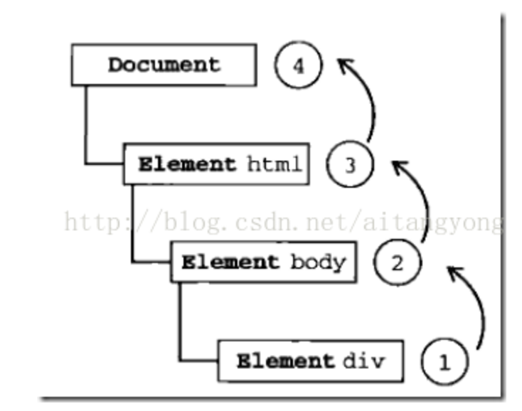
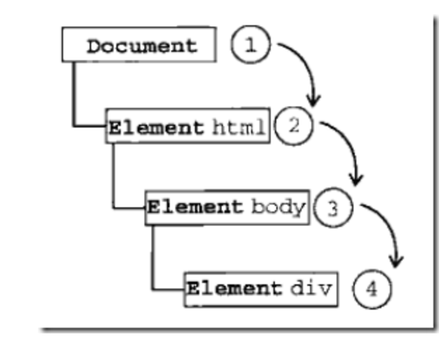
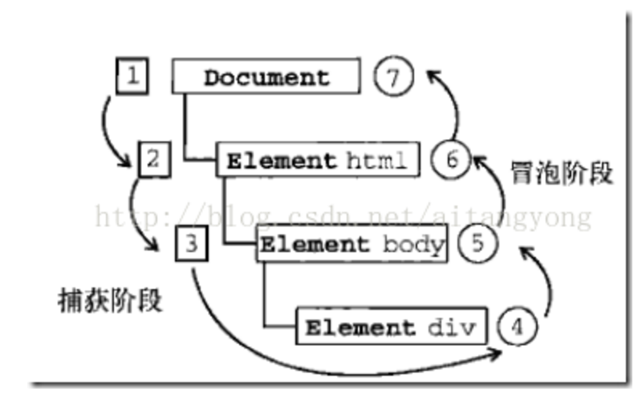

## javascript事件详解

## (一)事件绑定的几种方式

javascript给DOM绑定事件处理函数总的来说有2种方式：在html文档中绑定、在js代码中绑定。
下面的方式1、方式2属于在html中绑定事件，方式3、方式4和方式5属于在js代码中绑定事件，其中方法5是最推荐的做法。

### 方式1：
HTML的DOM元素支持onclick、onblur等以on开头属性，我们可以直接在这些属性值中编写javascript代码。
当点击div的时候，下面的代码会弹出div的ID：
```
<div id="outestA" onclick="var id = this.id;alert(id);return false;"></div>  
```

这种做法很显然不好，因为代码都是放在字符串里的，不能格式化和排版，当代码很多的时候很难看懂。
这里有一点值得说明：`onclick属性中的this代表的是当前被点击的DOM对象，所以我们可以通过this.id获取DOM元素的id属性值`。

### 方式2：

当代码比较多的时候，我们可以在onclick等属性中指定函数名。
跟上面的做法相比，这种做法略好一些。
值得一提的是：事件处理函数中的this代表的是window对象，所以我们在onclick属性值中，通过this将dom对象作为参数传递。
```
<script>
	function buttonHandler(thisDom)
	{
		alert(this.id);//undefined
		alert(thisDom.id);//outestA
		return false;
	}
</script>
<div id="outestA" onclick="return buttonHandler(this);"></div>
```

### 方式3：在JS代码中通过dom元素的onclick等属性
```
var dom = document.getElementById("outestA");
dom.onclick = function(){alert("1=" + this.id);};
dom.onclick = function(){alert("2=" + this.id);};
```

这种做法this代表当前的DOM对象。还有一点：这种做法只能绑定一个事件处理函数，后面的会覆盖前面的。

### 方式4：IE下使用attachEvent/detachEvent函数进行事件绑定和取消。

attachEvent/detachEvent兼容性不好，IE6~IE11都支持该函数，但是FF和Chrome浏览器都不支持该方法。
而且attachEvent/detachEvent不是W3C标准的做法，所以不推荐使用。
在IE浏览器下，attachEvent有以下特点。
```
a) 事件处理函数中this代表的是window对象，不是dom对象。
    var dom = document.getElementById("outestA");  
    dom.attachEvent('onclick',a);  
          
    function a()  
    {   
        alert(this.id);//undefined  
    }


b) 同一个事件处理函数只能绑定一次。
    var dom = document.getElementById("outestA");  
    dom.attachEvent('onclick',a);  
    dom.attachEvent('onclick',a);    
    function a()  
    {  
        alert(this.id);
    }

虽然使用attachEvent绑定了2次，但是函数a只会调用一次。

c)不同的函数对象，可以重复绑定，不会覆盖。
    var dom = document.getElementById("outestA");  
    dom.attachEvent('onclick',function(){alert(1);});  
    dom.attachEvent('onclick',function(){alert(1);});  
    // 当outestA的click事件发生时,会弹出2个对话框
```
匿名函数和匿名函数是互相不相同的，即使代码完全一样。
所以如果我们想用detachEvent取消attachEvent绑定的事件处理函数，那么绑定事件的时候不能使用匿名函数，
必须要将事件处事函数单独写成一个函数，否则无法取消。

### 方式5：使用W3C标准的addEventListener和removeEventListener。

这2个函数是W3C标准规定的，FF和Chrome浏览器都支持，IE6/IE7/IE8都不支持这2个函数。不过从IE9开始就支持了这2个标准的API。
```
// type:事件类型,不含"on",比如"click"、"mouseover"、"keydown";
// 而attachEvent的事件名称,含含"on",比如"onclick"、"onmouseover"、"onkeydown";
// listener:事件处理函数
// useCapture是事件冒泡,还是事件捕获,默认false,代表事件冒泡类型
addEventListener(type, listener, useCapture);
```

```
a) 事件处理函数中this代表的是dom对象，不是window，这个特性与attachEvent不同。
    var dom = document.getElementById("outestA");  
    dom.addEventListener('click', a, false);  
          
    function a()  
    {   
        alert(this.id);//outestA  
    }

b) 同一个事件处理函数可以绑定2次,一次用于事件捕获，一次用于事件冒泡。
    var dom = document.getElementById("outestA");  
    dom.addEventListener('click', a, false);  
    dom.addEventListener('click', a, true);  
          
    function a()  
    {   
        alert(this.id);//outestA  
    }
    
    // 当点击outestA的时候,函数a会调用2次

如果绑定的是同一个事件处理函数，并且都是事件冒泡类型或者事件捕获类型，那么只能绑定一次。

    var dom = document.getElementById("outestA");  
    dom.addEventListener('click', a, false);  
    dom.addEventListener('click', a, false);  
          
    function a()  
    {   
        alert(this.id);//outestA  
    }
    // 当点击outestA的时候,函数a只会调用1次

c) 不同的事件处理函数可以重复绑定，这个特性与attachEvent一致。
```

## (二)事件处理函数的执行顺序

方式1、方式2和方式3都不能实现事件的重复绑定，所以自然也就不存在执行顺序的问题。
方式4和方式5可以重复绑定特性，所以需要了解下执行顺序的问题。
如果你写出依赖于执行顺序的代码，可以断定你的设计存在问题。
所以下面的顺序问题，仅作为兴趣探讨，没有什么实际意义。
直接上结论：addEventListener和attachEvent表现一致,如果给同一个事件绑定多个处理函数，先绑定的先执行。
下面的代码我在IE11、FF17和Chrome39都测试过。
```
<script>
	window.onload = function(){
	<span style="white-space:pre">	</span>var outA = document.getElementById("outA");  
		outA.addEventListener('click',function(){alert(1);},false);
		outA.addEventListener('click',function(){alert(2);},true);
		outA.addEventListener('click',function(){alert(3);},true);
		outA.addEventListener('click',function(){alert(4);},true);
	};
</script>

<body>
	<div id="outA" style="width:400px; height:400px; background:#CDC9C9;position:relative;">
	</div>
</body>
```

当点击outA的时候，会依次打印出1、2、3、4。
这里特别需要注意：我们给outA绑定了多个onclick事件处理函数，也是直接点击outA触发的事件，
所以不涉及事件冒泡和事件捕获的问题，即addEventListener的第三个参数在这种场景下，没有什么用处。
如果是通过事件冒泡或者是事件捕获触发outA的click事件，那么函数的执行顺序会有变化。

## (三) 事件冒泡和事件捕获

事件冒泡和事件捕获很好理解，只不过是对同一件事情的不同看法，只不过这2种看法都很有道理。
我们知道HTML中的元素是可以嵌套的，形成类似于树的层次关系。比如下面的代码：
```
<div id="outA" style="width:400px; height:400px; background:#CDC9C9;position:relative;">
	<div id="outB" style="height:200; background:#0000ff;top:100px;position:relative;">
		<div id="outC" style="height:100px; background:#FFB90F;top:50px;position:relative;"></div> 
	</div>
</div>
```
如果点击了最内侧的outC，那么外侧的outB和outC算不算被点击了呢？
很显然算，不然就没有必要区分事件冒泡和事件捕获了，这一点各个浏览器厂家也没有什么疑义。
假如outA、outB、outC都注册了click类型事件处理函数，当点击outC的时候，
触发顺序是A–>B–>C，还是C–>B–>A呢？
如果浏览器采用的是事件冒泡，那么触发顺序是C–>B–>A，由内而外，像气泡一样，从水底浮向水面；
如果采用的是事件捕获，那么触发顺序是A–>B–>C，从上到下，像石头一样，从水面落入水底。

事件冒泡见下图：


事件捕获见下图：


一般来说事件冒泡机制，用的更多一些，所以在IE8以及之前，IE只支持事件冒泡。
IE9+/FF/Chrome这2种模型都支持，可以通过`addEventListener((type, listener, useCapture)`的useCapture来设定，
useCapture=false代表着事件冒泡，useCapture=true代表着采用事件捕获。
```
<script>

	window.onload = function(){
		var outA = document.getElementById("outA");  
		var outB = document.getElementById("outB");  
		var outC = document.getElementById("outC");  
		
		// 使用事件冒泡
		outA.addEventListener('click',function(){alert(1);},false);
		outB.addEventListener('click',function(){alert(2);},false);
		outC.addEventListener('click',function(){alert(3);},false);
	};
 
</script>

<body>
	<div id="outA" style="width:400px; height:400px; background:#CDC9C9;position:relative;">
		<div id="outB" style="height:200; background:#0000ff;top:100px;position:relative;">
			<div id="outC" style="height:100px; background:#FFB90F;top:50px;position:relative;"></div> 
		</div>
	</div>
</body>
```

使用的是事件冒泡，当点击outC的时候，打印顺序是3–>2–>1。如果将false改成true使用事件捕获，打印顺序是1–>2–>3。

## (四) DOM事件流

DOM事件流我也不知道怎么解释，个人感觉就是事件冒泡和事件捕获的结合体，直接看图吧。


DOM事件流：将事件分为三个阶段：`捕获阶段`、`目标阶段`、`冒泡阶段`。
先调用捕获阶段的处理函数，其次调用目标阶段的处理函数，最后调用冒泡阶段的处理函数。
这个过程很类似于Struts2框中的action和Interceptor。
当发出一个URL请求的时候，先调用前置拦截器，其次调用action，最后调用后置拦截器。

```
<script>

	window.onload = function(){
		var outA = document.getElementById("outA");  
		var outB = document.getElementById("outB");  
		var outC = document.getElementById("outC");  
		
		// 目标(自身触发事件,是冒泡还是捕获无所谓)
		outC.addEventListener('click',function(){alert("target");},true);
		
		// 事件冒泡
		outA.addEventListener('click',function(){alert("bubble1");},false);
		outB.addEventListener('click',function(){alert("bubble2");},false);
		
		// 事件捕获
		outA.addEventListener('click',function(){alert("capture1");},true);
		outB.addEventListener('click',function(){alert("capture2");},true);	
	};
 
</script>

<body>
	<div id="outA" style="width:400px; height:400px; background:#CDC9C9;position:relative;">
		<div id="outB" style="height:200; background:#0000ff;top:100px;position:relative;">
			<div id="outC" style="height:100px; background:#FFB90F;top:50px;position:relative;"></div> 
		</div>
	</div>
</body>
```

当点击outC的时候，依次打印出capture1–>capture2–>target–>bubble2–>bubble1。
到这里是不是可以理解`addEventListener(type,handler,useCapture)`这个API中第三个参数useCapture的含义呢？
useCapture=false意味着：将事件处理函数加入到冒泡阶段，在冒泡阶段会被调用；
useCapture=true意味着：将事件处理函数加入到捕获阶段，在捕获阶段会被调用。
从DOM事件流模型可以看出，捕获阶段的事件处理函数，一定比冒泡阶段的事件处理函数先执行。

## (五) 再谈事件函数执行先后顺序

在DOM事件流中提到过：
```
// 目标(自身触发事件,是冒泡还是捕获无所谓)
outC.addEventListener('click',function(){alert("target");},true);

我们在outC上触发onclick事件(这个是目标对象)，如果我们在outC上同时绑定捕获阶段/冒泡阶段事件处理函数会怎么样呢？
<script>

	window.onload = function(){
		var outA = document.getElementById("outA");  
		var outB = document.getElementById("outB");  
		var outC = document.getElementById("outC");  
		
		// 目标(自身触发事件,是冒泡还是捕获无所谓)
		outC.addEventListener('click',function(){alert("target2");},true);
		outC.addEventListener('click',function(){alert("target1");},true);
		
		// 事件冒泡
		outA.addEventListener('click',function(){alert("bubble1");},false);
		outB.addEventListener('click',function(){alert("bubble2");},false);
		
		// 事件捕获
		outA.addEventListener('click',function(){alert("capture1");},true);
		outB.addEventListener('click',function(){alert("capture2");},true);
	};
 
</script>

<body>
	<div id="outA" style="width:400px; height:400px; background:#CDC9C9;position:relative;">
		<div id="outB" style="height:200; background:#0000ff;top:100px;position:relative;">
			<div id="outC" style="height:100px; background:#FFB90F;top:50px;position:relative;"></div> 
		</div>
	</div>
</body>

点击outC的时候，打印顺序是:capture1–>capture2–>target2–>target1–>bubble2–>bubble1。
由于outC是我们触发事件的目标对象，在outC上注册的事件处理函数，属于DOM事件流中的目标阶段。
目标阶段函数的执行顺序：先注册的先执行，后注册的后执行。
这就是上面我们说的，在目标对象上绑定的函数是采用捕获，还是采用冒泡，都没有什么关系，
【 因为冒泡和捕获只是对父元素上的函数执行顺序有影响，对自己没有什么影响 】。如果不信，可以将下面的代码放进去验证。


// 目标(自身触发事件,是冒泡还是捕获无所谓)
outC.addEventListener('click',function(){alert("target1");},false);
outC.addEventListener('click',function(){alert("target2");},true);
outC.addEventListener('click',function(){alert("target3");},true);
outC.addEventListener('click',function(){alert("target4");},false);
```

至此我们可以给出事件函数执行顺序的结论了：捕获阶段的处理函数最先执行，其次是目标阶段的处理函数，最后是冒泡阶段的处理函数。
目标阶段的处理函数，先注册的先执行，后注册的后执行。

## (六) 阻止事件冒泡和捕获
默认情况下，多个事件处理函数会按照DOM事件流模型中的顺序执行。
如果子元素上发生某个事件，不需要执行父元素上注册的事件处理函数，那么我们可以停止捕获和冒泡，避免没有意义的函数调用。
前面提到的5种事件绑定方式，都可以实现阻止事件的传播。由于第5种方式，是最推荐的做法。
所以我们基于第5种方式，看看如何阻止事件的传播行为。

IE8以及以前可以通过 `window.event.cancelBubble=true`阻止事件的继续传播；
IE9+/FF/Chrome通过`event.stopPropagation()`阻止事件的继续传播。

```
<script>

	window.onload = function(){
		var outA = document.getElementById("outA");  
		var outB = document.getElementById("outB");  
		var outC = document.getElementById("outC");  
		
		// 目标
		outC.addEventListener('click',function(event){
			alert("target");
			event.stopPropagation();
		},false);

		// 事件冒泡
		outA.addEventListener('click',function(){alert("bubble");},false);

		// 事件捕获
		outA.addEventListener('click',function(){alert("capture");},true);		
		
	};
 
</script>

<body>
	<div id="outA" style="width:400px; height:400px; background:#CDC9C9;position:relative;">
		<div id="outB" style="height:200; background:#0000ff;top:100px;position:relative;">
			<div id="outC" style="height:100px; background:#FFB90F;top:50px;position:relative;"></div> 
		</div>
	</div>
</body>
```

当点击outC的时候，之后打印出capture–>target，不会打印出bubble。
因为当事件传播到outC上的处理函数时，通过stopPropagation阻止了事件的继续传播，所以不会继续传播到冒泡阶段。

最后再看一段更有意思的代码：
```
<script>

	window.onload = function(){
		var outA = document.getElementById("outA");  
		var outB = document.getElementById("outB");  
		var outC = document.getElementById("outC");  
		
		// 目标
		outC.addEventListener('click',function(event){alert("target");},false);

		// 事件冒泡
		outA.addEventListener('click',function(){alert("bubble");},false);

		// 事件捕获
		outA.addEventListener('click',function(){alert("capture");event.stopPropagation();},true);		
	};
</script>

<body>
	<div id="outA" style="width:400px; height:400px; background:#CDC9C9;position:relative;">
		<div id="outB" style="height:200; background:#0000ff;top:100px;position:relative;">
			<div id="outC" style="height:100px; background:#FFB90F;top:50px;position:relative;"></div> 
		</div>
	</div>
</body>

执行结果是只打印capture，不会打印target和bubble。
神奇吧，我们点击了outC，但是却没有触发outC上的事件处理函数，而是触发了outA上的事件处理函数。
原因不做解释，如果你还不明白，可以再读一遍本文章。
```