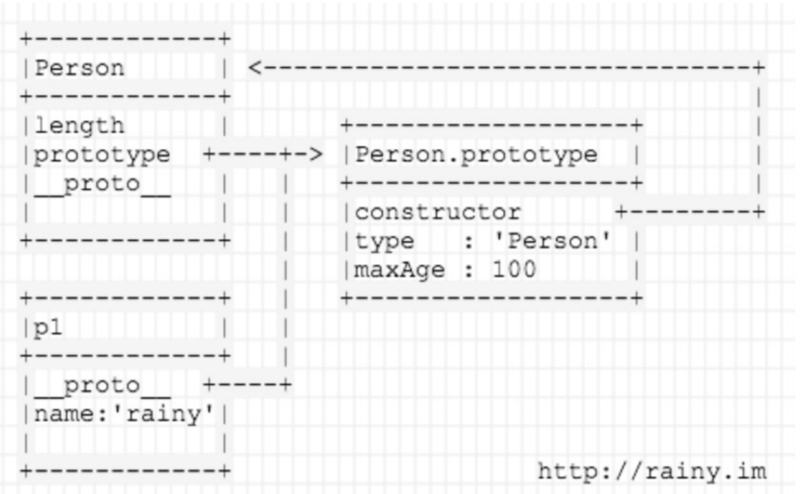
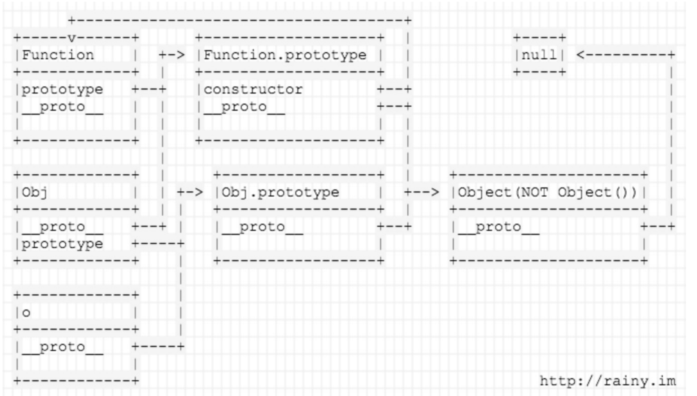

### 原型链详解

Js中变量作用域的相关概念，实际上关注的一个核心问题是：“在执行当前这行代码时Js解释器可以获取哪些变量”，
而原型与原型链实际上还是关于这一问题。

我们知道，在Js中一切皆为对象（Object），但是Js中并没有类（class）；
Js是基于原型（prototype-based）来实现的面向对象（OOP）的编程范式的，但并不是所有的对象都拥有prototype这一属性：

    var a = {};  
    console.log(a.prototype);  //=> undefined
    
    var b = function(){};  
    console.log(b.prototype);  //=> {}
    
    var c = 'Hello';  
    console.log(c.prototype);  //=> undefined  
    
prototype是每个function定义时自带的属性，但是Js中function本身也是对象，我们先来看一下下面几个概念的差别：

#### 1. function、Function、Object和{}

function是Js的一个关键词，用于定义函数类型的变量，有两种语法形式：

    function f1(){  
      console.log('This is function f1!');
    }
    typeof(f1);  //=> 'function'
    
    var f2 = function(){  
      console.log('This is function f2!');
    }
    typeof(f2);  //=> 'function'  
    
如果用更加面向对象的方法来定义函数，可以用Function：

    var f3 = new Function("console.log('This is function f3!');");  
    f3();        //=> 'This is function f3!'  
    typeof(f3);  //=> 'function'
    
    typeof(Function); //=> 'function'  
实际上Function就是一个用于构造函数类型变量的类，或者说是函数类型实例的构造函数（constructor）；
与之相似有的Object或String、Number等，都是Js内置类型实例的构造函数。
比较特殊的是Object，它用于生成对象类型，其简写形式为{}：

    var o1 = new Object();  
    typeof(o1);      //=> 'object'
    
    var o2 = {};  
    typeof(o2);     //=> 'object'
    
    typeof(Object); //=> 'function'  
    
#### 2. prototype VS \_\_proto\_\_

清楚了上面的概念之后再来看prototype：

Each function has two properties: length and prototype。
```
prototype和length是每一个函数类型自带的两个属性，而其它非函数类型并没有（开头的例子已经说明），
这一点之所以比较容易被忽略或误解，是因为所有类型的构造函数本身也是函数，所以它们自带了prototype属性：
```

```
    console.log(Object.prototype);  //=> Object {} 
    console.log(Function.prototype);//=> function() {} 
    console.log(String.prototype);  //=> String {length: 0, [[PrimitiveValue]]: ""} 
``` 

除了prototype之外，Js中的所有对象（undefined、null等特殊情况除外）都有一个内置的`[[Prototype]]`属性，
`指向它“父类”的prototype`，这个内置属性在ECMA标准中并没有给出明确的获取方式，
但是许多Js的实现（如Node、大部分浏览器等）都提供了一个`__proto__`属性来指代这一`[[Prototype]]`，
我们通过下面的例子来说明实例中的`__proto__`是如何指向构造函数的prototype的：

    var Person = function(){};  
    Person.prototype.type = 'Person';  
    Person.prototype.maxAge = 100;
    
    var p = new Person();  
    console.log(p.maxAge);  
    p.name = 'rainy';
    
    Person.prototype.constructor === Person;  //=> true  
    p.__proto__ === Person.prototype;         //=> true  
    console.log(p.prototype);                 //=> undefined  
上面的代码示例可以用下图解释：



Person是一个函数类型的变量，因此自带了prototype属性，prototype属性中的constructor又指向Person本身；
通过new关键字生成的Person类的实例p1，通过__proto__属性指向了Person的原型。
这里的__proto__只是为了说明实例p1在内部实现的时候与父类之间存在的关联（指向父类的原型），
在实际操作过程中实例可以直接通过.获取父类原型中的属性，从而实现了继承的功能。

#### 3. 原型链

清楚了prototype与__proto__的概念与关系之后我们会对“Js中一切皆为对象”这句话有更加深刻的理解。
进而我们会想到，既然__proto__是（几乎）所有对象都内置的属性，而且指向父类的原型，
那是不是意味着我们可以“逆流而上”一直找到源头呢？
我们来看下面的例子：

    var Obj = function(){};  
    var o = new Obj();  
    o.__proto__ === Obj.prototype;  //=> true  
    o.__proto__.constructor === Obj; //=> true
    
    Obj.__proto__ === Function.prototype; //=> true  
    Obj.__proto__.constructor === Function; //=> true
    
    Function.__proto__ === Function.prototype; //=> true  
    Object.__proto__ === Object.prototype;     //=> false  
    Object.__proto__ === Function.prototype;   //=> true
    
    Function.__proto__.constructor === Function;//=> true  
    Function.__proto__.__proto__;               //=> {}  
    Function.__proto__.__proto__ === o.__proto__.__proto__; //=> true  
    o.__proto__.__proto__.__proto__ === null;   //=> true  



从上面的例子和图解可以看出，prototype对象也有`__proto__`属性，向上追溯一直到null。

new关键词的作用就是完成上图所示实例与父类原型之间关系的串接，并创建一个新的对象；
`instanceof`关键词的作用也可以从上图中看出，实际上就是判断`__proto__`
（以及__proto__.__proto__...）所指向是否父类的原型：

    var Obj = function(){};  
    var o = new Obj();
    
    o instanceof Obj; //=> true  
    o instanceof Object; //=> true  
    o instanceof Function; //=> false
    
    o.__proto__ === Obj.prototype; //=> true  
    o.__proto__.__proto__ === Object.prototype; //=> true  
    o.__proto__.__proto__ === Function;  //=> false  